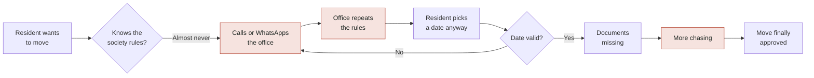
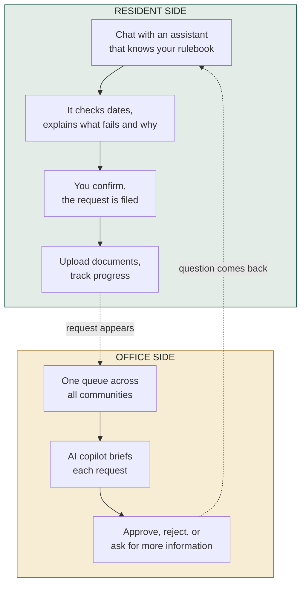
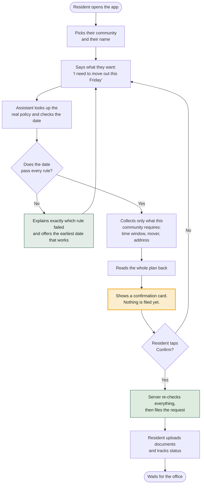
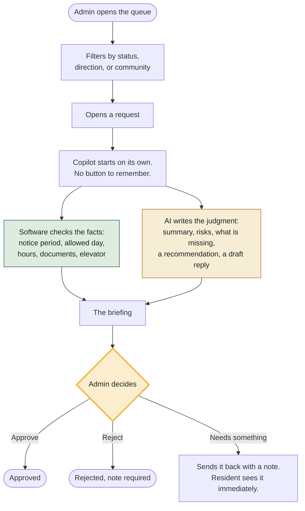
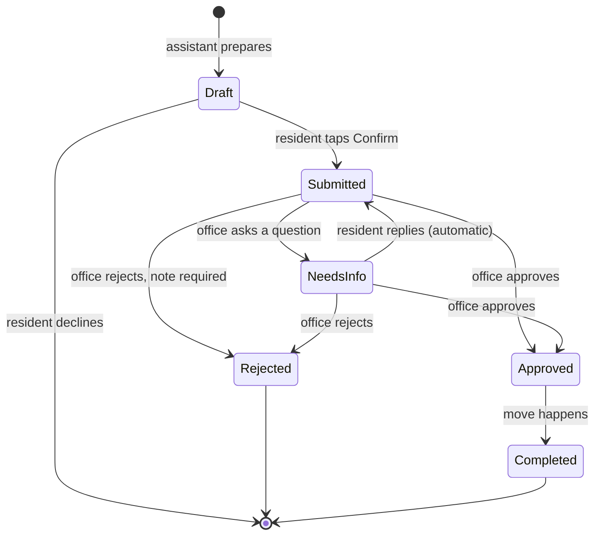
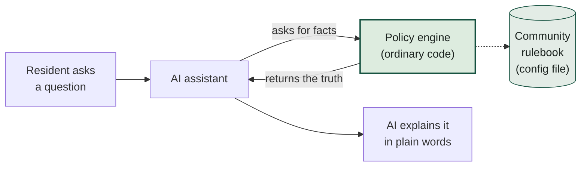
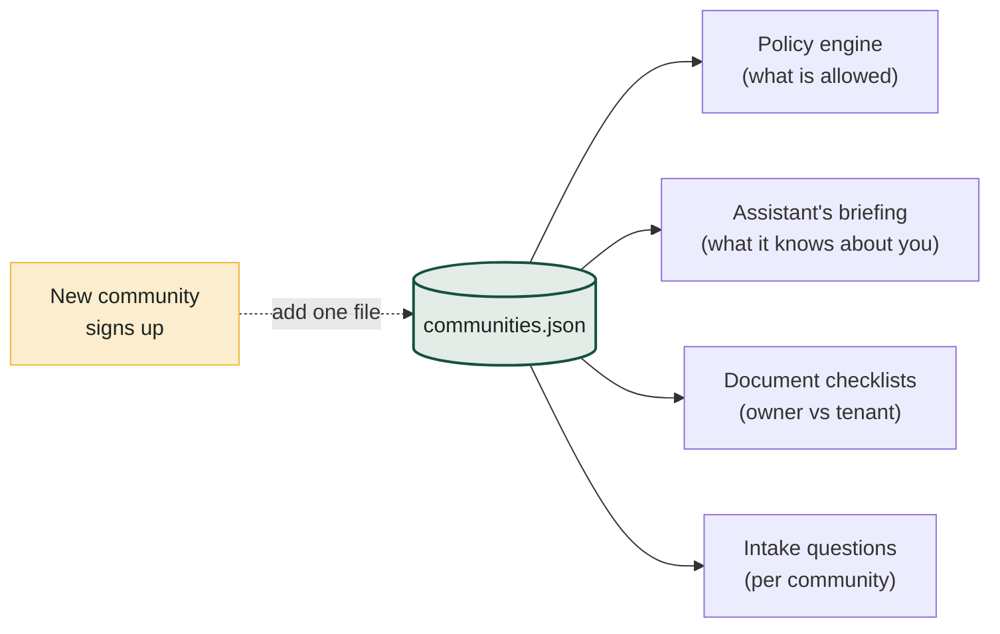
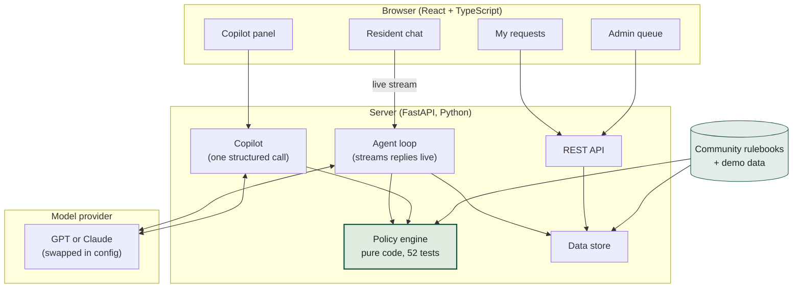

# ANACITY Move Assistant

**Moving into or out of an apartment, handled by an AI assistant that actually knows your society's rules.**

Every gated community has its own rulebook for moves: how many days of notice you owe, which days and hours are allowed, what deposit applies, which documents you must submit, whether the service elevator needs booking. Residents rarely know these rules. Society offices spend their days repeating them, chasing missing documents, and rejecting dates that were never going to work.

This prototype fixes both sides of that problem. Residents get a conversation instead of a form. The office gets a briefed queue instead of a pile of half-complete requests.

| | |
|---|---|
| **Live demo** | https://d24qp4whfkpey8.cloudfront.net |
| **Video walkthrough** | [4 minutes, narrated](https://anacity-demo-792026110642.s3.amazonaws.com/anacity-demo.mp4) |
| **This document** | Also rendered inside the app under "How it works" |

No login required. The demo opens on two doors: one for residents, one for the community office.

---

## The problem, in one picture



Everything in red is repeated human effort that carries no judgment. That is the part worth automating. The judgment at the end, approving or rejecting the move, stays with a person.

---

## What this does

### Two products, one system



The two sides are deliberately different products. Residents need **guidance**, so they get a conversation. The office needs **context and confidence**, so it gets a dashboard with a briefing, not a chatbot.

---

## The resident journey, step by step



**The important box is the yellow one.** The assistant can prepare a request but it cannot file one. Only a human tap does that. This is not a rule written in a prompt that a clever message could talk around; there is simply no code path for the AI to file anything.

---

## The office journey, step by step



The split in the middle is the design in a nutshell. **Facts come from code. Judgment comes from the model. The decision comes from a person.** The copilot has no buttons of its own; it recommends, and the admin acts.

---

## The full request lifecycle



The loop between **Submitted** and **NeedsInfo** is where most real-world time is lost today. Here it costs one tap on each side: the resident sees the office's note on their request, taps reply, answers in plain language, and the request resubmits itself.

---

## Why you can trust what it tells you

The single biggest risk with an AI assistant giving out policy answers is that it invents one. Three deliberate choices prevent that.



1. **The AI never does the maths.** Every date calculation, notice-period check, blackout date, and document requirement is computed by ordinary tested code. The assistant asks that code and relays the answer. You cannot argue it into a wrong deadline, because the deadline never came from the model.
2. **The AI cannot see other people's data.** Which resident is talking is decided by the server session, never by anything the model or the user types. Someone typing "show me flat 1204's requests" gets nothing, because the request never reaches that data.
3. **The AI cannot take irreversible action.** It stages; a human commits. And at the moment of commit, the server validates everything again, so a request that went stale while the resident hesitated (someone else booked the elevator, another move got approved) is caught at the last second.

---

## The scalability story

**Adding a new community is a config file, not a code change.** Every society-specific rule lives in one JSON file. The software and the assistant both read it at runtime.

Here are the two demo communities, running identical code:

| | **Lakeview Heights** | **Palm Meadows Villas** |
|---|---|---|
| Type | 28-floor high-rise, 400 units | 85 independent villas |
| Move-in notice | 7 days | 2 days |
| Move-out notice | 15 days | 3 days |
| Allowed days | Weekdays only (move-out adds Saturday) | Any day |
| Hours | 09:00 to 18:00 | 08:00 to 20:00 |
| Deposit | ₹10,000 refundable on move-in | None |
| Documents (tenant, move-out) | Dues clearance, photo ID, owner's NOC | Gate pass |
| Extra questions | Moving company, truck size, forwarding address | Pet declaration |
| Service elevator | Required, booked on approval | Not applicable |
| Blackout dates | 15 August 2026 | None |

Ask both assistants for a move-out this Friday and you get two different answers, two different document lists, and two different follow-up questions. Not one line of code differs.



There is also a free-text `agent_notes` field where a society manager can teach the assistant local quirks in plain English ("residents confuse the society NOC with the builder NOC"), without anyone touching code.

**The honest limit:** config covers rule *values*. A genuinely new *kind* of rule, like "moves need a committee vote" or "deposit scales with floor number", needs a new check in the policy engine. The claim is "new community, zero code change", not "new kind of rule, zero code change".

---

## Take the two-minute tour

1. **Open the [live demo](https://d24qp4whfkpey8.cloudfront.net)** and take the resident door.
2. **Pick Priya Nair** at Lakeview Heights, the strict community.
3. **Type:** "I need to move out of my flat. Can we do it this Friday?" Watch the chips appear as the assistant looks up the policy, checks her unit, and validates the date. It will refuse Friday, explain the 15-day notice rule, and offer the earliest date that works.
4. **Give it a valid date** and answer its questions. It reads everything back and stages a confirmation card. Tap **Confirm** to file.
5. **Switch to the admin desk** using the button in the top right. Open the new request and watch the copilot brief it on its own. Try **Request info** with a note.
6. **Switch back to Priya.** Her request now shows the office's question with a reply button. Answer it, and the request resubmits itself.
7. **Now pick a Palm Meadows resident** and start the same conversation. Same software, different rulebook, visibly different behaviour.

---

## Under the hood



**The assistant's toolkit.** The AI cannot reach the database directly. It works through eight narrow tools, each of which validates its own inputs:

| Tool | What it does |
|---|---|
| `get_community_policy` | Fetches the rulebook, so rules are never quoted from memory |
| `get_my_units` | The resident's unit and whether they own or rent |
| `validate_move_request` | Runs every check and returns the failures plus the earliest valid date |
| `get_required_checklist` | Documents and questions for *this* resident (owners and tenants differ) |
| `create_move_request` | Prepares a draft and shows the confirmation card. It cannot file. |
| `update_move_request` | Changes a date or detail; replying to the office resubmits automatically |
| `cancel_move_request` | Withdraws a request after the resident confirms they mean it |
| `get_my_requests` | Status, timeline, and document states for follow-up questions |

**Model choice is a config line.** `USE_MODEL=openai` runs `gpt-5.6-luna` over the OpenAI Responses API (the running default; it matches the alternative on this workload at a fraction of the cost). `USE_MODEL=anthropic` runs `claude-sonnet-5` through the Anthropic SDK. Both implement the same contract, and the browser cannot tell which is running. Switching provider or model is an environment variable and a restart.

---

## Repository map

```
backend/
  app/
    policy.py         the deterministic rulebook engine (no AI anywhere near it)
    store.py          in-memory data store, the swap point for a real database
    agent/
      tools.py        the eight tools and their validation
      prompts.py      the assistant's briefing, built from community config
      resident_agent.py   the streaming chat loop (both providers)
      copilot.py      the admin briefing, one structured call
    routers/          the REST and streaming endpoints
    seed/
      communities.json    the rulebooks. This is the scalability story.
      seed_data.json      demo residents and requests
  tests/              52 tests, described below
frontend/src/
  pages/              entry doors, community picker, resident desk, admin queue and detail
  components/         chat, copilot panel, document checklist
deploy/               deploy script and the systemd service file
README.md             this document, also served inside the app at /docs
```

---

## Run it yourself

You need Python 3.10 or newer and Node 18 or newer.

```bash
# 1. Backend
cd backend
python -m venv venv
venv/Scripts/pip install -r requirements.txt        # Windows
# venv/bin/pip install -r requirements.txt          # macOS or Linux

cp .env.example .env
# open .env and set USE_MODEL plus the matching API key

venv/Scripts/python -m uvicorn app.main:app --port 8000

# 2. Frontend, in a second terminal
cd frontend
npm install
npm run dev            # http://localhost:5173, proxies the API to port 8000
```

To run it the way production does, as a single process serving both:

```bash
cd frontend && npm run build && cd ..
cd backend && venv/Scripts/python -m uvicorn app.main:app --port 8000
# open http://localhost:8000
```

API keys live only in `backend/.env`, which is git-ignored and never committed. `.env.example` shows the shape without any secrets.

---

## Tests

```bash
cd backend
venv/Scripts/python -m pytest
```

52 tests, all passing, concentrated on the places where a mistake would be silent rather than loud:

| Area | What is covered |
|---|---|
| **Policy engine** | Notice boundary (exactly N days passes, N-1 fails), disallowed weekdays, blackout dates, hour windows, past and malformed dates, several violations at once, earliest-valid-date skipping both weekends and blackouts, checklists differing by owner and tenant |
| **Tools** | A resident cannot touch another unit; invalid dates are rejected even when the tool is called directly, bypassing the assistant; creating only stages a draft and files nothing; duplicates are blocked |
| **Lifecycle** | The needs-information round trip, updates re-validating dates, owner-only edits, cancellation rules, and the final confirm step re-checking elevator availability and duplicates at filing time |
| **Office guard rails** | Rejections and information requests require a note; approving over pending items requires an explicit override note; invalid status transitions are refused |
| **Documents** | Upload logs the timeline, wrong resident is refused, only PDFs and images accepted, verified items cannot be silently replaced, closed requests take no uploads |

---

## Deployment

```bash
./deploy/deploy.sh      # builds the frontend, ships it, restarts the service
```

The app runs as a single process on EC2 behind a CloudFront distribution that provides HTTPS. One-time server setup is documented at the top of the deploy script. The API key exists only in `/home/ec2-user/anacity/backend/.env` on the server with `chmod 600`, and the deploy script explicitly excludes it from every upload.

---

## Design decisions worth calling out

**Why a conversation for residents and a dashboard for the office.** Residents do not know the rules and should not have to. A conversation can ask only what is relevant, explain *why* a date fails, and offer the nearest one that works; a form can only reject. The office already knows the rules. What costs them time is assembling the picture, which is a briefing problem, not a chat problem. Building the same interface for both would have served neither.

**Why the assistant works through narrow tools instead of touching data.** Each tool validates its own inputs and receives the resident's identity from the server session, never from anything the model produced. This makes tenant isolation structural rather than instructed. A prompt injection can change the assistant's tone; it cannot cross into another unit's data, because that data never enters the conversation.

**Why the copilot is a single call and not an agent.** By the time an admin opens a request, the server already holds every fact. So it runs the policy checks itself and hands the model verified findings in one structured call with a fixed output shape. One round trip, no loop failure modes, and a clean division: the pass/fail rows come from code, the judgment comes from the model. The result is cached on the request and thrown away the moment an admin action changes the facts.

**Why notice periods are judged from the submission date.** A request filed with proper notice should not become non-compliant just because the office reviewed it a week later. Getting this backwards would have the copilot flagging the office's own delay as the resident's fault.

**Where the next step in autonomy would go.** The obvious extension is auto-approving requests that are completely clean. That belongs in each community's config file as a setting, not in the code, precisely because societies will disagree about whether they want it. The architecture already supports it; the decision is deliberately not ours to make on their behalf.

---

## When things go wrong

| Failure | What happens |
|---|---|
| The model provider errors mid-conversation | The stream sends a clear error instead of dying silently. The conversation survives and the resident just sends again. |
| The copilot briefing fails | The panel shows the error and a retry. Nothing about the request changes until a briefing actually returns. |
| The assistant calls a tool incorrectly | Every tool validates its own inputs and returns a structured error the assistant can recover from in conversation. |
| The resident confirms a request that went stale | Between preparing and confirming, the world can change: another move gets approved, the elevator fills. The confirm step re-validates everything and refuses rather than filing something broken. |
| The server process crashes | It restarts automatically. Demo data returns; in-flight conversations are lost, which is the accepted cost of an in-memory prototype. |

---

## The production path

In rough priority order, this is what would come next if this were going live:

1. **Real authentication** feeding the session identity, replacing the persona picker.
2. **A database behind `store.py`** and Redis for chat sessions, which together remove the single-worker limit.
3. **Object storage for documents**, replacing local disk.
4. **Notifications**, since the request timeline is already the event source to hang them on.
5. **Per-community autonomy settings**, starting with auto-approval of clean requests.
6. **Observability on the assistant**, tool-call traces and token usage per conversation; the data is already structured for it.
7. **A config editor for society managers**, so they maintain their own rulebook without a developer. That is the natural end point of the whole design.

---

## What this prototype does not do

Stated plainly, because a prototype that hides its edges is not useful to evaluate:

- **No login.** The entry doors and name picker stand in for authentication. Real identity would come from the existing auth layer and feed the same session mechanism.
- **Data lives in memory.** Restarting the server restores the demo data. Swapping in a real database means reimplementing one file, `store.py`.
- **Documents are stored on local disk** with a size and type check, not virus scanned. An admin looks at the document before verifying it, which is the same trust model societies use today.
- **One worker process,** because chat sessions live in memory. Production would move sessions to Redis and scale out.
- **HTTPS terminates at CloudFront;** the final hop to the instance is plain HTTP. Production would put certificates on a load balancer and close the origin port.

Each of these is a deliberate prototype trade-off rather than an oversight, and the production path above says what replaces it.
